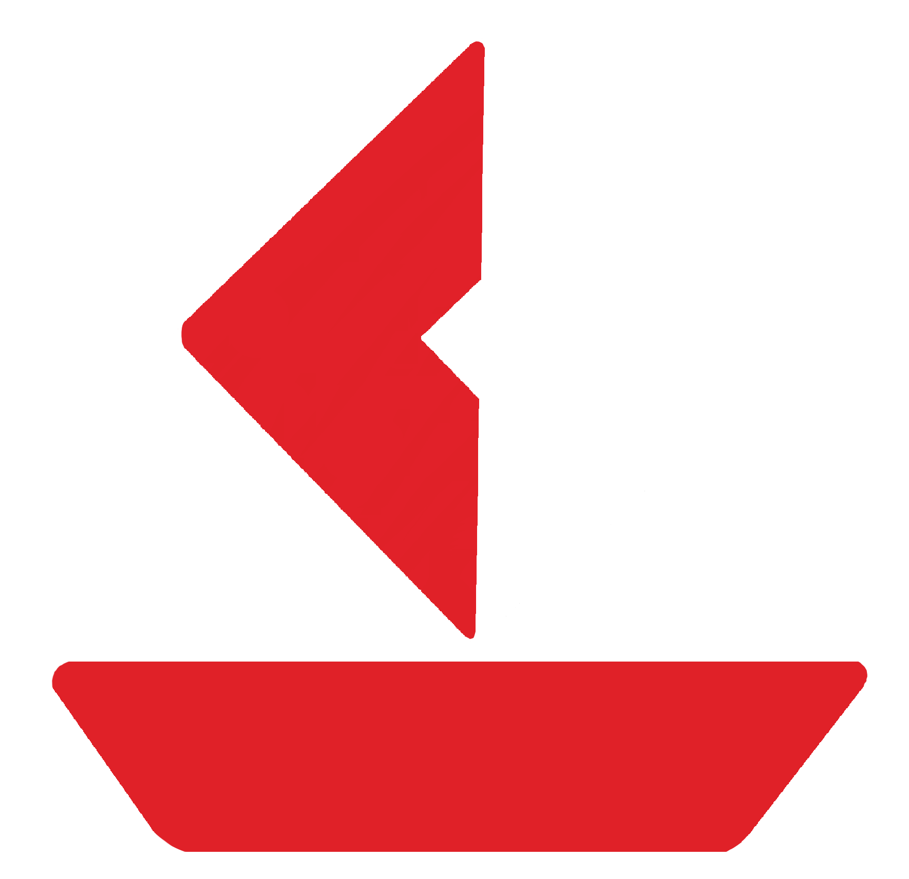

[](https://crates.io/crates/roboat)
[](https://docs.rs/roboat/)
[](https://deps.rs/repo/github/chloe-woahie/roboat)

[](https://discord.gg/QmBEgPaFSD)


# roboat



A high performance interface for the Roblox API.

This library is designed to be high-performance capable, meaning that it supports proxies
and is capable of making requests in parallel.

Note that this crate is still in early development and updates may be breaking until the first major version is released.

# Documentation

Extensive documentation is used throughout this crate.
All public methods in this crate are documented and have at least one corresponding example.

Documentation can be found [here](https://docs.rs/roboat/).

# Coverage
* Auth API - [`auth.roblox.com/*`]
    - Force Refresh X-CSRF-TOKEN - [`Client::force_refresh_xcsrf_token`](https://docs.rs/roboat/latest/roboat/struct.Client.html#method.force_refresh_xcsrf_token)
* BEDEV2 API - [`apis.roblox.com/*`] 
    - Fetch Non-Tradable Limited Details - [`Client::non_tradable_limited_details`](https://docs.rs/roboat/latest/roboat/struct.Client.html#method.non_tradable_limited_details)
    - Fetch Collectible Product ID - [`Client::collectible_product_id`](https://docs.rs/roboat/latest/roboat/struct.Client.html#method.collectible_product_id)
    - Fetch Collectible Product ID Bulk - [`Client::collectible_product_id_bulk`](https://docs.rs/roboat/latest/roboat/struct.Client.html#method.collectible_product_id_bulk)
    - Fetch Collectible Creator ID - [`Client::collectible_creator_id`](https://docs.rs/roboat/latest/roboat/struct.Client.html#method.collectible_creator_id)
    - Purchase Non-Tradable Limited - [`Client::purchase_non_tradable_limited`](https://docs.rs/roboat/latest/roboat/struct.Client.html#method.purchase_non_tradable_limited)
* Catalog API - [`catalog.roblox.com/*`]
    - Fetch Item Details - [`Client::item_details`](https://docs.rs/roboat/latest/roboat/struct.Client.html#method.item_details)
    - Fetch Product ID - [`Client::product_id`](https://docs.rs/roboat/latest/roboat/struct.Client.html#method.product_id)
    - Fetch Product ID Bulk - [`Client::product_id_bulk`](https://docs.rs/roboat/latest/roboat/struct.Client.html#method.product_id_bulk)
    - Fetch Collectible Item ID - [`Client::collectible_item_id`](https://docs.rs/roboat/latest/roboat/struct.Client.html#method.collectible_item_id)
    - Fetch Collectible Item ID Bulk - [`Client::collectible_item_id_bulk`](https://docs.rs/roboat/latest/roboat/struct.Client.html#method.collectible_item_id_bulk)
    - Avatar Catalog Search - [`Client::avatar_catalog_search`](https://docs.rs/roboat/latest/roboat/struct.Client.html#method.avatar_catalog_search)
* Chat API - [`chat.roblox.com/*`]
    - Fetch Unread Conversation Count - [`Client::unread_conversation_count`](https://docs.rs/roboat/latest/roboat/struct.Client.html#method.unread_conversation_count)
* Economy API - [`economy.roblox.com/*`]
    - Fetch Robux Balance - [`Client::robux`](https://docs.rs/roboat/latest/roboat/struct.Client.html#method.robux)
    - Fetch Resellers - [`Client::resellers`](https://docs.rs/roboat/latest/roboat/struct.Client.html#method.resellers)
    - Fetch User Sales - [`Client::user_sales`](https://docs.rs/roboat/latest/roboat/struct.Client.html#method.user_sales)
    - Put Limited On Sale - [`Client::put_limited_on_sale`](https://docs.rs/roboat/latest/roboat/struct.Client.html#method.put_limited_on_sale)
    - Take Limited Off Sale - [`Client::take_limited_off_sale`](https://docs.rs/roboat/latest/roboat/struct.Client.html#method.take_limited_off_sale)
    - Purchase Tradable Limited - [`Client::purchase_tradable_limited`](https://docs.rs/roboat/latest/roboat/struct.Client.html#method.purchase_tradable_limited)
* Group API - [`groups.roblox.com/*`]
    - Fetch Group Roles - [`Client::group_roles`](https://docs.rs/roboat/latest/roboat/struct.Client.html#method.group_roles)
    - Fetch Group Role Members - [`Client::group_role_members`](https://docs.rs/roboat/latest/roboat/struct.Client.html#method.group_role_members)
    - Set Group Member Role - [`Client::set_group_member_role`](https://docs.rs/roboat/latest/roboat/struct.Client.html#method.set_group_member_role)
* Presence API - [`presence.roblox.com/*`]
    - Register Presence - [`Client::register_presence`](https://docs.rs/roboat/latest/roboat/struct.Client.html#method.register_presence)
* Private Messages API - [`privatemessages.roblox.com/*`]
    - Fetch Messages - [`Client::messages`](https://docs.rs/roboat/latest/roboat/struct.Client.html#method.messages)
* Thumbnails API - [`thumbnails.roblox.com/*`]
    - Fetch Thumbnail Url Bulk - [`Client::thumbnail_url_bulk`](https://docs.rs/roboat/latest/roboat/struct.Client.html#method.thumbnail_url_bulk)
    - Fetch Thumbnail Url - [`Client::thumbnail_url`](https://docs.rs/roboat/latest/roboat/struct.Client.html#method.thumbnail_url)
* Trades API - [`trades.roblox.com/*`]
    - Accept Trade - [`Client::accept_trade`](https://docs.rs/roboat/latest/roboat/struct.Client.html#method.accept_trade)
    - Decline Trade - [`Client::decline_trade`](https://docs.rs/roboat/latest/roboat/struct.Client.html#method.decline_trade)
    - Send Trade - [`Client::send_trade`](https://docs.rs/roboat/latest/roboat/struct.Client.html#method.send_trade)
    - Fetch Trades List - [`Client::trades`](https://docs.rs/roboat/latest/roboat/struct.Client.html#method.trades)
    - Fetch Trade Details - [`Client::trade_details`](https://docs.rs/roboat/latest/roboat/struct.Client.html#method.trade_details)
    - Fetch Trade Count - [`Client::trade_count`](https://docs.rs/roboat/latest/roboat/struct.Client.html#method.trade_count)
* Users API - [`users.roblox.com/*`]
    - Fetch User ID - [`Client::user_id`](https://docs.rs/roboat/latest/roboat/struct.Client.html#method.user_id)
    - Fetch Username - [`Client::username`](https://docs.rs/roboat/latest/roboat/struct.Client.html#method.username)
    - Fetch Display Name - [`Client::display_name`](https://docs.rs/roboat/latest/roboat/struct.Client.html#method.display_name)
    - User Search - [`Client::user_search`](https://docs.rs/roboat/latest/roboat/struct.Client.html#method.user_search)
    - Username User Search - [`Client::username_user_search`](https://docs.rs/roboat/latest/roboat/struct.Client.html#method.username_user_search)
    - Fetch User Details - [`Client::user_details`](https://docs.rs/roboat/latest/roboat/struct.Client.html#method.user_details)
* Friends API - [`friends.roblox.com/*`]
    - Fetch Count of Pending Friend Requests - [`Client::pending_friend_requests`](https://docs.rs/roboat/latest/roboat/struct.Client.html#method.pending_friend_requests)
    - Fetch Friend Requests - [`Client::friend_requests`](https://docs.rs/roboat/latest/roboat/struct.Client.html#method.friend_requests)
    - Fetch Friends List - [`Client::friends_list`](https://docs.rs/roboat/latest/roboat/struct.Client.html#method.friends_list)
    - Accept Friend Request - [`Client::accept_friend_request`](https://docs.rs/roboat/latest/roboat/struct.Client.html#method.accept_friend_request)
    - Decline Friend Request - [`Client::decline_friend_request`](https://docs.rs/roboat/latest/roboat/struct.Client.html#method.decline_friend_request)
    - Send Friend Request - [`Client::send_friend_request`](https://docs.rs/roboat/latest/roboat/struct.Client.html#method.send_friend_request)
    - Unfriend - [`Client::unfriend`](https://docs.rs/roboat/latest/roboat/struct.Client.html#method.unfriend)
* UNDER CONSTRUCTION
    - Upload Classic Clothing to Group - [`Client::upload_classic_clothing_to_group`](https://docs.rs/roboat/latest/roboat/struct.Client.html#method.upload_classic_clothing_to_group)

# Setup

You can add the latest version of roboat to your project by running:

```bash
cargo add roboat
```

# Quick Start Examples

## Example 1 - Purchase Free UGC Limited

This code snippet allows you to purchase a free ugc limited.

It can be modified to purchase a non-free ugc limited by changing the price.

```rust
// Replace this value with your own roblosecurity token.
const ROBLOSECURITY: &str = "your-roblosecurity-token";
// Replace this value with the item id of the item you want to purchase.
const ITEM_ID: u64 = 13119979433;
// Replace this value if you want to purchase a non-free item.
const PRICE: u64 = 0;

#[tokio::main]
async fn main() -> Result<(), Box<dyn std::error::Error>> {
    let client = roboat::ClientBuilder::new()
        .roblosecurity(ROBLOSECURITY.to_string())
        .build();

    let collectible_item_id = client.collectible_item_id(ITEM_ID).await?;

    let collectible_product_id = client
        .collectible_product_id(collectible_item_id.clone())
        .await?;

    let collectible_creator_id = client
        .collectible_creator_id(collectible_item_id.clone())
        .await?;

    client
        .purchase_non_tradable_limited(
            collectible_item_id,
            collectible_product_id,
            collectible_creator_id,
            PRICE,
        )
        .await?;

    println!("Purchased item {} for {} robux!", ITEM_ID, PRICE);

    Ok(())
}
```

## Example 2 - Fetch User Info

This code snippet allows you to get your current robux, id, username, and display name.

```rust
// Replace this value with your own roblosecurity token.
const ROBLOSECURITY: &str = "your-roblosecurity-token";

#[tokio::main]
async fn main() -> Result<(), Box<dyn std::error::Error>> {
    let client = roboat::ClientBuilder::new()
        .roblosecurity(ROBLOSECURITY.to_string())
        .build();

    let robux = client.robux().await?;
    let user_id = client.user_id().await?;
    let username = client.username().await?;
    let display_name = client.display_name().await?;

    println!("Robux: {}", robux);
    println!("User ID: {}", user_id);
    println!("Username: {}", username);
    println!("Display Name: {}", display_name);

    Ok(())
}
```

## Example 3 - Fetch Price of Tradable Limited

This code snippet allows you to view the lowest price of a tradable limited item by
fetching a list of reseller listings.

```rust
// Replace this value with your own roblosecurity token.
const ROBLOSECURITY: &str = "your-roblosecurity-token";

#[tokio::main]
async fn main() -> Result<(), Box<dyn std::error::Error>> {
    let client = roboat::ClientBuilder::new()
        .roblosecurity(ROBLOSECURITY.to_string())
        .build();

    let item_id = 1365767;
    let limit = roboat::Limit::Ten;
    let cursor = None;

    let (resellers, _) = client.resellers(item_id, limit, cursor).await?;

    println!("Lowest Price for Valkyrie Helm: {}", resellers[0].price);

    Ok(())
}
```

## Example 4 - Fetch Item Details

This code snippet allows you to get the details of an item.

```rust
use roboat::catalog::avatar_catalog::{ItemArgs, ItemType};

#[tokio::main]
async fn main() -> Result<(), Box<dyn std::error::Error>> {
    let client = roboat::ClientBuilder::new().build();

    let item = ItemArgs {
        item_type: ItemType::Asset,
        id: 1365767,
    };

    let details = &client.item_details(vec![item]).await?[0];

    let name = &details.name;
    let description = &details.description;
    let creator_name = &details.creator_name;
    let price = details.price.unwrap_or(0);

    println!("Name: {}", name);
    println!("Description: {}", description);
    println!("Creator Name: {}", creator_name);
    println!("Price: {}", price);

    Ok(())
}
```

# More Examples

More examples can be found in the [examples](examples) directory.

# Related Crates

This crate is a sister crate of [roli](https://crates.io/crates/roli), an API wrapper for [Rolimons.com](https://www.rolimons.com/).

# Requesting

Don't see an endpoint you need covered? Request it in an issue or join the [Discord Server](https://discord.com/invite/QmBEgPaFSD) and mention it to us in the #api-coverage-requests channel! Since Roblox has a lot of endpoints,
we find it easier to add endpoints as they are needed/requested.

# Contributing

Pull requests and issues are welcome!

Please refer to [CONVENTIONS.md](CONVENTIONS.md) for information on conventions used in this crate.

Additional resources used to help make this crate are available in [RESOURCES.md](RESOURCES.md).

# License

MIT License
